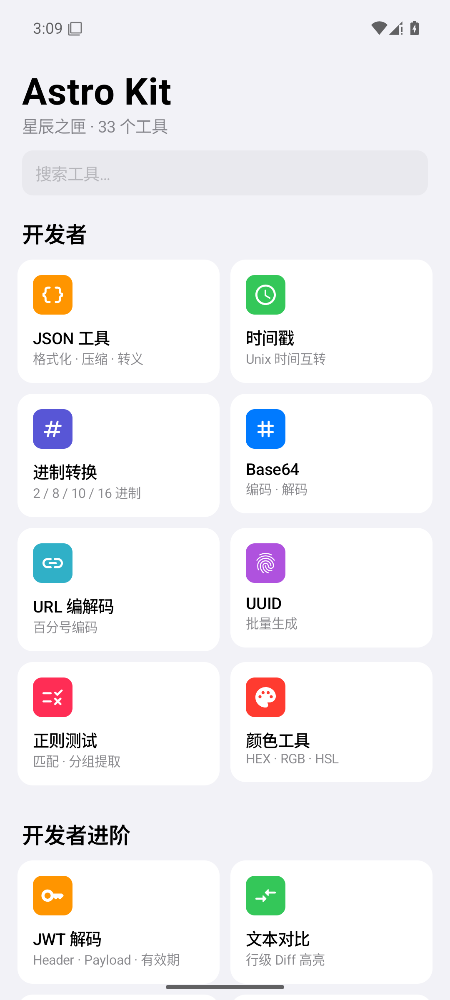
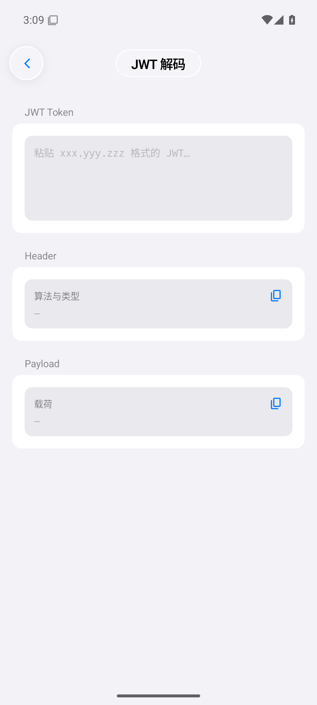
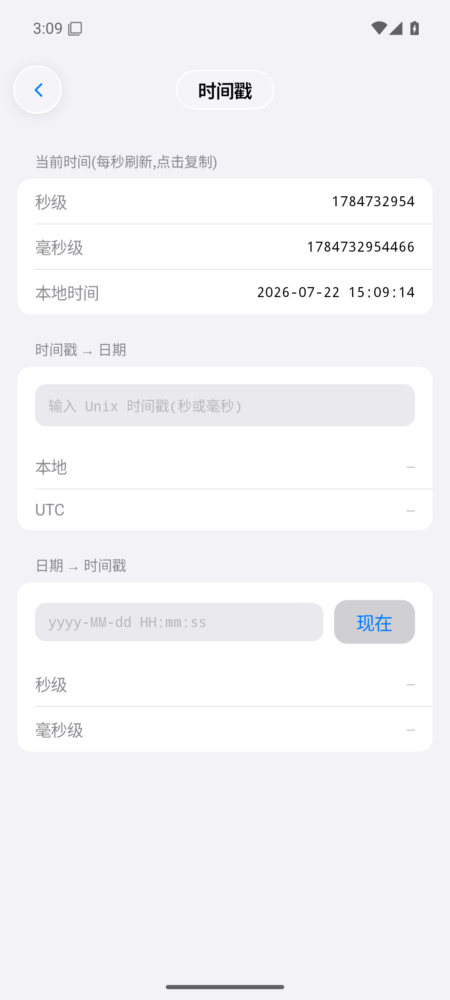
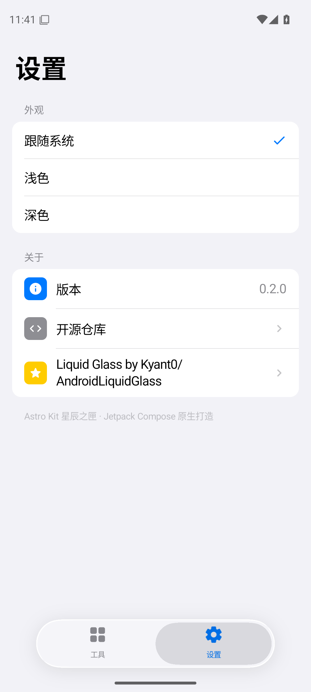

<div align="center">

# ✨ Astro Kit · 星辰之匣

**Liquid Glass 设计的 Android 全能工具箱**

30+ 个纯本地工具 · 零权限常驻(仅更新检查联网) · 无广告 · 无追踪

[](https://github.com/Beicho/native-toolbox/releases/latest)
[](https://github.com/Beicho/native-toolbox/actions)
-34C759)


<p>




</p>

</div>

## 亮点

- **正统 Liquid Glass**:基于 [Kyant0/AndroidLiquidGlass](https://github.com/Kyant0/AndroidLiquidGlass) 2.0,悬浮玻璃 Dock 可拖拽、带折射与色散;内容层严格实色,遵循 Apple 玻璃只在悬浮层的规范。Android 13+ 完整折射,老设备自动降级。
- **iOS 观感**:系统级配色、分组列表、分段选择器、大标题排版,深浅色跟随系统。
- **隐私优先**:所有工具纯本地计算,仅「检查更新」访问 GitHub API;不收集任何数据。
- **系统级整合**:任意 App 分享文本直达工具、桌面长按快捷方式、常用工具自动置顶、内置更新检查。

## 工具清单(32)

| 分类 | 工具 |
|---|---|
| **开发者** | JSON 格式化/压缩/转义 · 时间戳互转 · 进制转换 · Base64 · URL 编解码 · UUID 批量 · 正则测试 · 颜色转换 |
| **开发者进阶** | JWT 解码 · 文本 Diff · Cron 解析(未来执行时间)· 文件哈希 |
| **文本** | MD5/SHA 哈希 · 去重/排序/大小写 · 字数统计 · 随机密码 · 文件编码批量转换(GBK→UTF-8) |
| **图片** | 二维码生成/识别 · WiFi 二维码 · 图片压缩 · PNG/JPG/WebP 互转 · 图片取色 |
| **图片创作** | 证件防盗水印 · 九宫格切图 · 长截图拼接 · EXIF 查看与抹除 |
| **实用** | 单位换算 · 日期计算 · 设备信息 · 水平仪 · 屏幕坏点检测 |
| **整活** | 弹幕横幅(举牌神器)· 帮我决定(今天吃什么) |

## 下载

前往 [Releases](https://github.com/Beicho/native-toolbox/releases/latest) 下载最新 APK。App 内设置页可一键检查更新。

> 当前使用 debug 签名,跨大版本升级如遇签名冲突需先卸载旧版。

## 技术栈

- **UI**:Jetpack Compose · Material 3 · [AndroidLiquidGlass](https://github.com/Kyant0/AndroidLiquidGlass)(backdrop 2.0)
- **语言/构建**:Kotlin 2.3 · AGP 8.13 · compileSdk 37 · minSdk 29
- **依赖极简**:ZXing(二维码)· ExifInterface · DataStore,无网络框架、无统计 SDK

## 构建

```bash
./gradlew assembleDebug    # 需要 JDK 17+ 与 Android SDK Platform 37.0
```

CI 会在每次 push 时自动出包(Actions Artifacts)。

## 架构备忘

玻璃组件(Dock / 顶栏)必须渲染在 `layerBackdrop` 录制层之外,否则玻璃会绘制包含自身的图层,导致 RenderThread 无限递归崩溃 —— 详见 `MainActivity` 的分层注释。

## 致谢

- [Kyant0/AndroidLiquidGlass](https://github.com/Kyant0/AndroidLiquidGlass) — Liquid Glass 效果核心
- [ZXing](https://github.com/zxing/zxing) — 二维码编解码

## License

仅供学习交流使用。
